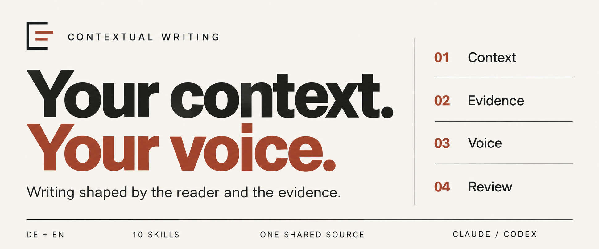
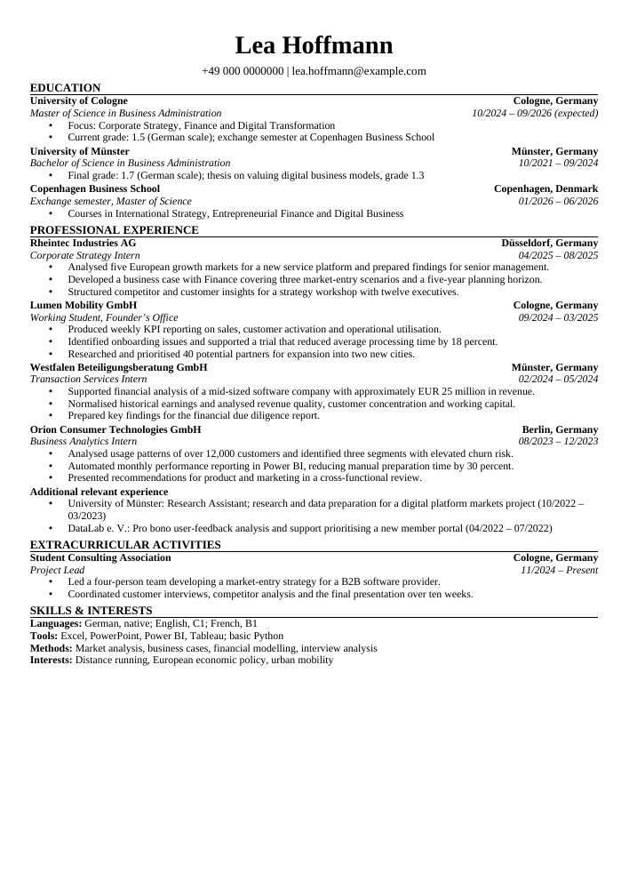
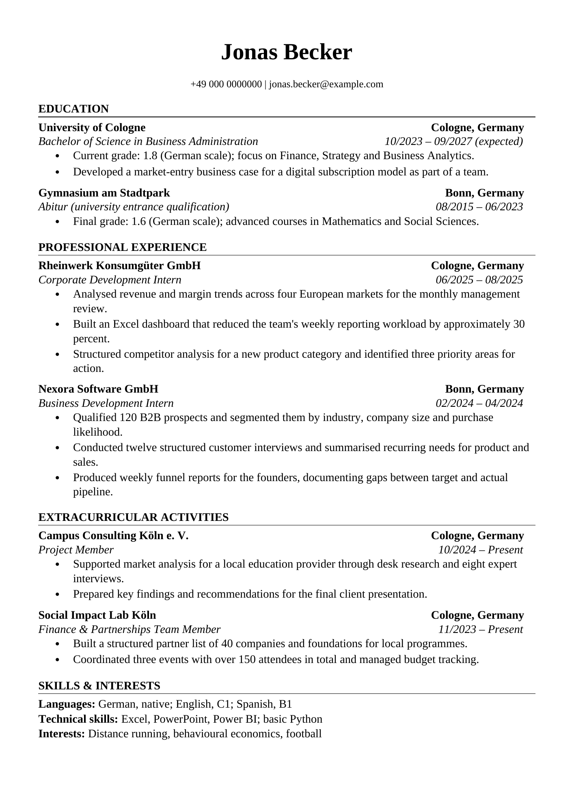

<p>
  
</p>

<p>
  <a href="https://github.com/optimelv/contextual-writing-skill/actions/workflows/validate.yml"></a>
  <a href="LICENSE"></a>
</p>

German and English writing skills for **Claude and Codex**. Draft, research, edit, and review using the actual brief, audience, evidence, and author's voice. A cover letter, a research paragraph, and a client email should not all sound the same.

[Install](#install) · [Example](#see-the-difference) · [Templates](#template-gallery) · [Skills](#components) · [Validation](#validation)

## Install

### Claude Code: plugin installation

Inside Claude Code, add the marketplace and install the plugin:

```text
/plugin marketplace add optimelv/contextual-writing-skill
/plugin install contextual-writing@contextual-writing
```

The repository contains both the marketplace and the plugin.

<details>
<summary><strong>Update or uninstall</strong></summary>

```text
/plugin marketplace update contextual-writing
/plugin update contextual-writing@contextual-writing
```

```text
/plugin uninstall contextual-writing@contextual-writing
```

Restart Claude Code if prompted after an update.

</details>

### Codex and other agents: install with npx

From your project directory:

```bash
npx skills add optimelv/contextual-writing-skill --skill '*'
```

Choose your agent when prompted. To install directly for Codex:

```bash
npx skills add optimelv/contextual-writing-skill --skill '*' --agent codex --yes
```

Requires Node.js and npm. Keep `'*'` quoted and install all ten skills: focused workflows reference shared rules in sibling folders. This installs skills through the [Skills CLI](https://github.com/vercel-labs/skills), not the plugin manifest. Choose either this route or a native plugin installation to avoid duplicate skills.

<details>
<summary><strong>Already using the Codex plugin?</strong></summary>

Keep your existing installation and invoke `$contextual-writing`. Codex reads `.codex-plugin/plugin.json`; Claude Code and Claude Cowork use `.claude-plugin/plugin.json`. Both manifests share the same skills, references, templates, and guards. The Claude marketplace configuration is separate.

</details>

## See the difference

**Illustrative edit with a fictional applicant.** Supplied facts: mapped an onboarding workflow and supported implementation for three customers. No leadership role or measured improvement was provided.

| Draft | Evidence-preserving revision |
| :--- | :--- |
| “I spearheaded a transformative onboarding initiative, driving significant customer success and operational excellence.” | “I mapped the onboarding workflow and supported implementation for three customers.” |

The revision makes the work concrete while preserving the applicant's actual contribution. This demonstrates the intended approach; it is not a measured benchmark result.

### Try it on your own material

```text
Application writing
Write a cover letter using my CV and this job description.
Ask for missing evidence. Do not invent achievements. Write in German.

Academic writing
Revise this discussion paragraph. Keep the citations and uncertainty;
make the implication clearer without extending the findings.

Outreach
Draft an email from this verified company update and our pilot result.
Treat the possible customer problem as a hypothesis. Use one clear CTA.
```

## How it handles your writing

- **Context first.** Reuse supplied material and ask only for gaps that change the answer.
- **Claims stay grounded.** Preserve ownership, qualifications, metrics, citations, uncertainty, and intentional cuts.
- **Instructions are not just style samples.** Explicit requirements take priority over ordinary style defaults. Later corrections apply in their stated context, not automatically to every future task.
- **Editing has a stopping point.** Change passages with a concrete problem. Leave fit-for-purpose text alone.
- **Submission checks come last.** Check hard limits, requested fields, recipient-facing wording, and claim strength before calling the result ready.

A mandatory submission rule cannot be waived by a style preference. When requirements conflict, the skill identifies the conflict rather than silently dropping one.

## Components

One router selects the workflow that owns the deliverable. Editing and research can support it without replacing it.

| Skill | Primary scope |
| --- | --- |
| `contextual-writing` | Automatic router, context gate, evidence rules, language selection, and optional profile use |
| `write-career-documents` | CVs, resumes, cover letters, proactive internship or job outreach, application fields, biographies, and professional profiles |
| `write-professional-communication` | Emails, messages, memos, meeting follow-ups, reports, technical, administrative, and legal-context communication |
| `write-commercial-content` | Evidence-led sales outreach, customer, buyer, partner, marketing, web, and competitive content |
| `write-academic-content` | Academic paragraphs, abstracts, paper sections, literature syntheses, and scholarly revisions from supplied material |
| `write-research-content` | Lightweight academic, legal, company, product, and fact-check research |
| `write-slides-and-strategy` | Consulting, strategy, startup, investor, sales, and decision-led slide narratives |
| `write-general-content` | Articles, essays, posts, website copy, personal prose, and other general writing |
| `edit-and-humanize` | Context-aware audits, minimal edits, voice calibration, translation review, and null edits |
| `teach-and-explain` | Explanations, tutoring, exam support, and accessible learning material |

Codex invocation metadata makes the router the automatic entry point and keeps focused skills explicit. Claude and other agents use their own discovery rules; Codex metadata does not configure them. You can explicitly invoke the router to select a focused workflow.

## Template gallery

Open a preview to inspect the complete PDF directly on GitHub. Each English example fits on one A4 page and uses fictional experience. German writing remains supported across all workflows.

| Dense CV | Early-career CV | Cover letter |
| :---: | :---: | :---: |
| [](docs/previews/generic-cv-template.pdf) | [](docs/previews/generic-cv-template-early-career.pdf) | [](docs/previews/generic-cover-letter-template.pdf) |
| [PDF](docs/previews/generic-cv-template.pdf) · [Word](skills/write-career-documents/assets/generic-cv-template.docx) | [PDF](docs/previews/generic-cv-template-early-career.pdf) · [Word](skills/write-career-documents/assets/generic-cv-template-early-career.docx) | [PDF](docs/previews/generic-cover-letter-template.pdf) · [Word](skills/write-career-documents/assets/generic-cover-letter-template.docx) |

Replace the fictional content with verified experience. These are starting points, not a universal page-count or layout rule. Creating and visually checking new Word or PDF files requires document tools in your host environment.

## Context and privacy

The package does not include a private biography, chat export, personal writing samples, or a populated user profile. Optional profile and intake templates are blank; document examples are fictional. Saving a profile requires an explicit request and destination. Sensitive traits are not inferred or inserted into a document merely because they were shared for collaboration.

Material you provide is handled by your AI platform and connected tools under their settings. The plugin is not a separate privacy or data-processing service.

## Product boundary

The plugin does not optimise for AI-detector scores or promise to conceal authorship. Academic Content handles scholarly writing from supplied evidence; Research Content handles lightweight evidence gathering. Deep academic research, legal advice, CRM-grounded sales work, and editable slide production need the relevant specialist tools or professionals.

Surface checks cannot certify factual or semantic correctness. Word and character counts do not replace the destination's own counter.

## Source method

The rules combine independently formulated writing principles, anonymized lessons from repeated editing work, and selected concepts from the sources listed in `NOTICE.md`. No personal examples or third-party pattern catalogues are copied into the runtime instructions.

## Validation

Run every deterministic package, routing, privacy, guard, and contract test with:

```bash
python3 scripts/run_tests.py
```

For behavioral evaluation, use [the scenarios](tests/forward_cases.json) with [the fresh-context review protocol](tests/FORWARD_TESTING.md). Record the actual outputs and limitations. The deterministic test command validates scenario structure and coverage, **not the quality of generated writing**.

Found a weak output? [Open an issue](https://github.com/optimelv/contextual-writing-skill/issues) with an anonymised brief, expected behavior, actual result, and model/plugin version. Remove private source material before posting.

---

[MIT license](LICENSE) · [Sources and acknowledgments](NOTICE.md)
