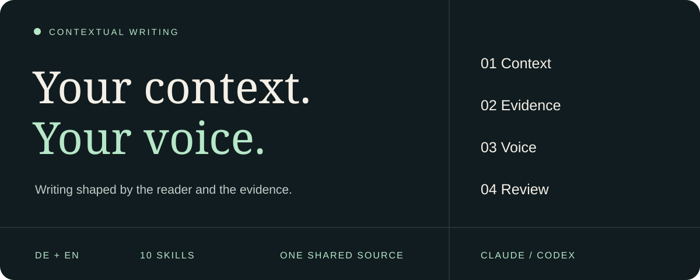
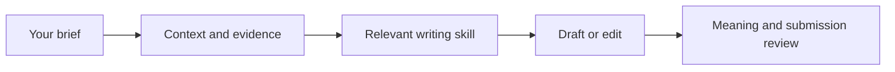

<p align="center">
  
</p>

<p align="center">
  <a href="https://github.com/optimelv/contextual-writing-skill/actions/workflows/validate.yml"></a>
  <a href="LICENSE"></a>
  
  
</p>

<p align="center"><strong>Ten writing workflows. One shared set of principles.</strong><br>Write, research, edit, and review with the reader, evidence, and author's voice in view.</p>

<p align="center"><a href="#install">Install</a> · <a href="#see-the-difference">See the difference</a> · <a href="#template-gallery">Preview templates</a> · <a href="#components">Explore the skills</a> · <a href="#validation">Validation</a></p>

---

Contextual Writing is a shareable German and English writing plugin. It creates, researches, edits, and reviews content according to the real audience, purpose, language, evidence, risk, and output format. It does not impose one personality or one universal style.

## Install

This repository is the single source of truth for both runtimes. Codex reads `.codex-plugin/plugin.json`; Claude Code and Claude Cowork read `.claude-plugin/plugin.json`. The skills, references, templates, guards, and tests are shared so the Claude version is kept current with the Codex version instead of becoming a separate fork.

### Claude Code: plugin installation

Inside Claude Code, add the marketplace and install the plugin:

```text
/plugin marketplace add optimelv/contextual-writing-skill
/plugin install contextual-writing@contextual-writing
```

The repository hosts both the marketplace and the plugin. This is the recommended Claude installation for namespacing and plugin management.

<details>
<summary><strong>Update or uninstall</strong></summary>

```text
/plugin marketplace update contextual-writing
/plugin update contextual-writing@contextual-writing
```

```text
/plugin uninstall contextual-writing@contextual-writing
```

Restart Claude Code if prompted after an update.

</details>

### Codex and other agents: install with npx

From your project directory:

```bash
npx skills add optimelv/contextual-writing-skill --skill '*'
```

Choose your agent when prompted. To install directly for Codex:

```bash
npx skills add optimelv/contextual-writing-skill --skill '*' --agent codex --yes
```

Requires Node.js and npm. Keep `'*'` quoted and install all ten skills: focused workflows reference shared rules in sibling folders. This installs skills through the [Skills CLI](https://github.com/vercel-labs/skills), not the plugin manifest. Choose either this route or a native plugin installation to avoid duplicate skills.

<details>
<summary><strong>Already using the Codex plugin?</strong></summary>

Keep your existing installation and invoke `$contextual-writing`. The repository includes `.codex-plugin/plugin.json` for native Codex plugin packaging; the Claude marketplace configuration is separate.

</details>

## See the difference

**Illustrative edit with a fictional applicant.** Supplied facts: mapped an onboarding workflow and supported implementation for three customers. No leadership role or measured improvement was provided.

| Draft | Evidence-preserving revision |
| :--- | :--- |
| “I spearheaded a transformative onboarding initiative, driving significant customer success and operational excellence.” | “I mapped the onboarding workflow and supported implementation for three customers.” |

The revision makes the work concrete while preserving the applicant's actual contribution. This demonstrates the intended approach; it is not a measured benchmark result.

### Bring a real task

```text
Application writing
Write a cover letter using my CV and this job description.
Ask for missing evidence. Do not invent achievements. Write in German.

Academic writing
Revise this discussion paragraph. Keep the citations and uncertainty;
make the implication clearer without extending the findings.

Outreach
Draft an email from this verified company update and our pilot result.
Treat the possible customer problem as a hypothesis. Use one clear CTA.
```



## Components

| Skill | Primary scope |
| --- | --- |
| `contextual-writing` | Automatic router, context gate, evidence rules, language selection, and optional profile use |
| `write-career-documents` | CVs, resumes, cover letters, proactive internship or job outreach, application fields, biographies, and professional profiles |
| `write-professional-communication` | Emails, messages, memos, meeting follow-ups, reports, technical, administrative, and legal-context communication |
| `write-commercial-content` | Evidence-led sales outreach, customer, buyer, partner, marketing, web, and competitive content |
| `write-academic-content` | Academic paragraphs, abstracts, paper sections, literature syntheses, and scholarly revisions from supplied material |
| `write-research-content` | Lightweight academic, legal, company, product, and fact-check research |
| `write-slides-and-strategy` | Consulting, strategy, startup, investor, sales, and decision-led slide narratives |
| `write-general-content` | Articles, essays, posts, website copy, personal prose, and other general writing |
| `edit-and-humanize` | Context-aware audits, minimal edits, voice calibration, translation review, and null edits |
| `teach-and-explain` | Explanations, tutoring, exam support, and accessible learning material |

Codex invocation metadata makes the router the automatic entry point and keeps focused skills explicit. Claude and other agents use their own discovery rules; Codex metadata does not configure them. You can explicitly invoke the router to select a focused workflow.

## Template gallery

Open a preview to inspect the complete PDF directly on GitHub. Each English example fits on one A4 page and uses fictional experience. German writing remains supported across all workflows.

| Dense CV | Early-career CV | Cover letter |
| :---: | :---: | :---: |
| [](docs/previews/generic-cv-template.pdf) | [](docs/previews/generic-cv-template-early-career.pdf) | [](docs/previews/generic-cover-letter-template.pdf) |
| [View PDF](docs/previews/generic-cv-template.pdf) | [View PDF](docs/previews/generic-cv-template-early-career.pdf) | [View PDF](docs/previews/generic-cover-letter-template.pdf) |

<details>
<summary><strong>Download editable Word templates</strong></summary>

- [Dense CV (.docx)](skills/write-career-documents/assets/generic-cv-template.docx)
- [Early-career CV (.docx)](skills/write-career-documents/assets/generic-cv-template-early-career.docx)
- [Cover letter (.docx)](skills/write-career-documents/assets/generic-cover-letter-template.docx)

These are editable sources for the PDF previews. Replace the fictional content with verified experience. Creating and visually checking new Word or PDF files requires document tools in your host environment.

</details>

## Context and privacy

The distributed plugin contains no private biography, writing samples, chat export, or user profile. Optional profile and intake templates contain blank fields only. Users decide whether to provide or save personal context. Sensitive traits are never inferred, required by default, or inserted into a document without explicit authorization. Material you supply is handled by your chosen AI platform and connected tools under their settings.

Career-document assets include anonymized native Word templates for a dense consulting-style CV, a sparse early-career CV, and a formal cover letter. Their content is fictional and must be replaced. Layout is content-driven: spacing, typography and margins are adjusted incrementally and verified through rendering instead of being fixed globally.

## Product boundary

The plugin improves reader fit, truthfulness, clarity, register, and voice. It does not optimize for AI detector scores or promise to conceal authorship. Academic Content owns scholarly drafting and revision from supplied evidence; Research Content owns lightweight evidence gathering; deep academic research remains owned by specialist workflows. Legal advice, CRM-grounded sales workflows, and editable slide production remain owned by specialist plugins or qualified professionals. Contextual Writing prepares inputs, provides a safe lightweight path, and hands off when depth or risk requires it.

Recipient-visible and hard-limit artifacts use a shared submission-readiness gate for exact instructions, word or character limits, internal-note separation, semantic one-action checks, target specificity, and claim strength. A deterministic helper checks surface constraints but does not replace semantic review or the destination's own counter.

## Source method

The rules combine independently formulated writing principles, anonymized lessons from repeated editing work, and selected concepts from the sources listed in `NOTICE.md`. No personal examples or third-party pattern catalogues are copied into the runtime instructions.

## Validation

Run every deterministic package, routing, privacy, guard, and contract test with:

```bash
python3 scripts/run_tests.py
```

Use `tests/forward_cases.json` together with `tests/FORWARD_TESTING.md` for versioned fresh-model forward tests that evaluate actual writing behavior. The deterministic test command validates the pack protocol, but it does not score generated outputs or claim benchmark performance.

Found a weak output? [Open an issue](https://github.com/optimelv/contextual-writing-skill/issues) with an anonymized brief, expected behavior, actual result, model and plugin version.

---

<p align="center">Built for thoughtful writing in German and English.<br><a href="LICENSE">MIT license</a> · <a href="NOTICE.md">Sources and acknowledgments</a></p>
